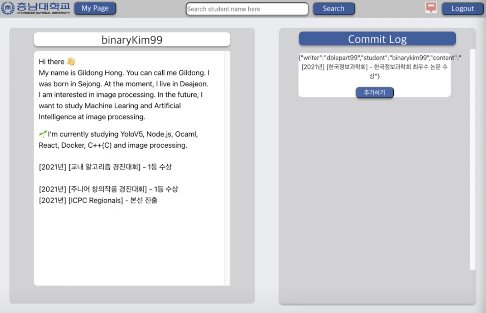

# [Check_Git_Out](http://checkgitout.com) : GitHub API를 활용한 이력서 서비스

## 프로젝트 개요

인터넷이 발달함에 따라 온라인 이력서 서비스(Linkedin, 사람인, Wanted 등)가 활성화 되었다.
구직자는 자신의 이력을 쉽게 작성할 수 있다는 장점이 있는 반면, 구인자는 특정 이력에 대하여 신뢰성을 완전히 보장받지 못한다.

이러한 문제상황을 해결하기 위해 Check-Git-Out은 추천자의 전자서명이 포함된 이력을 제공받아 신뢰성을 보장받을 수 있다.
이 프로젝트는 신뢰성이 보장된 이력서를 제공하는 것을 목표로 한다.

## 사용 기술 스택

- NGINX
- Node.js (Express.js)
- React
- MySQL
- GitHub API(Octokit library)

## 용어 정리

- 구직자 : 학생, 개발자 등등 이력서의 주인.
- 추천자 : 이력서에 이력을 작성해주는 이력의 관계자 (교수, 멘토 등)

## 설치 방법

해당 레포지토리를 Git clone을 해옵니다.

### GitHub 설정 방법

여러 명의 추천자가 한 명의 학생에게 동시 작업을 하는 방법에는 여러 방법이 존재한다. 추천자 개개인이 fork를 딴 후 commit을 하는 방식 등등.
그러나 좀 더 편리한 관리를 위해 GitHub의 Organization 기능을 사용하도록 하였다.
먼저 추천자들의 GitHub 계정을 Organization에 추가한다. 현재로서는 [CNUCSE-RESUME](https://github.com/CNUCSE-RESUME)라는 Orgaization을 통해 관리가 된다.

## 주요 작동 방식

1. 구직자는 `${username}+Resume`라는 형식의 이름으로 레포지토리를 생성한다.
2. 구직자는 해당 레포지토리에 Readme.md 파일을 생성하고 이력서를 작성한다.
3. 추천자는 CNUCSE-RESUME의 member로 등록을 한다.
4. 추천자는 구직자의 레포지토리를 CNUCSE-RESUME로 fork한다.
5. 추천자는 Check-Git-Out을 이용하여 구직자를 검색한다.
   

6. 추천자는 검색한 구직자에 대하여 이력을 작성한다.

   ( 작성된 이력은 구직자의 Readme.md로 바로 입력되는 것이 아닌, Check-Git-Out의
   데이터베이스에 저장된다.)

7. 구직자는 Check-Git-Out에 접속하여 My Page에서 자신의 이력 변동사항을 확인할 수 있다.
   

8. 구직자는 입력된 이력 중 원하는 이력을 선택하여 추가 버튼을 클릭한다.
   
   추가하기 버튼을 클릭하면, 데이터베이스에서 구직자에게 입력된 이력은 삭제되고, 추천자의 GitHub토큰으로 Organization에 fork해온 Readme.md가 수정되고, Pull Request를 생성하고, 구직자의 GitHub 토큰으로 Merge가 수행된다.

### Backend - Server 설정

- Node.js 서버 실행.

  ```bash
  cd server
  npm install

  nodemon app.js //백엔드 서버를 8080 포트로 연다.
  ```

- Server 폴더 구조

  - app.js
    - express.js를 이용하여 라우터가 설정되어있다. 서버는 8080 포트로 연다.
  - auth
    - auth.js : 로그인을 위한 라우터이다. client단에서 GitHub API를 이용하여 던진 code를 받아 GitHub에서 토큰을 받아온다.
  - commit
    - commitLogRouter.js : 추천자가 구직자에게 입력한 이력을 DB에 저장한다.
    - deleteAll.js : 특정 구직자에 대하여 DB에 저장되어있는 모든 이력을 DB에서 모두 삭제한다.
    - deleteCommit.js : 특정 구직자에 대하여 DB에 저장되어있는 특정 이력만 삭제한다.
    - getCommitLog.js : 특정 구직자에게 저장되어있는 모든 이력을 가져온다.
    - makeCommit.js : fork해온 레포지토리로 이력을 commit한다.
  - db
    - database.js : mysql connection을 통해 생성한 후 Pool안에 등록하여
      connection을 조절해준다. getConnection함수를 이용하여 연결된 것을 반환한다.
  - merge
    - merge.js : Pull Request에 대하여 merge를 수행해준다.
  - pullrequest
    - checkPR.js : 생성된 Pull Request가 있는지 확인을 수행한다.
    - prRouter.js : Pull Request를 생성하는 라우터이다.

### Backend - Database 설정

- Database 설정

  ```sql
  CREATE DATABASE gResume;

  use gResume;

  CREATE TABLE user(
  username VARCHAR(30),
  type VARCHAR(30) DEFAULT 'Student',
  token VARCHAR(50),
  PRIMARY KEY(username));


  CREATE TABLE commitlog(
  username VARCHAR(50) not null,
  content VARCHAR(50),
  stu_username varchar(50) not null,
  id VARCHAR(50),
  token VARCHAR(50) not null,
  PRIMARY KEY(id)
  );
  ```

  - user Table에는 회원들의 이름, type(구직자 or 추천자), 토큰을 저장한다.
  - commitlog Table에는 추천자의 이름, 입력한 이력내용, 이력 대상자 이름, 이력내용 식별자, 작성자의 토큰을 저장한다.

### Frontend

- React build

  ```bash
  cd client
  npm install //필요한 npm을 설치한다.
  ```

  ```bash
  npm run build //react static build를 한다.
                //nginx를 이용하여 80번 포트로 React static build파일을 serving한다.
  ```

- Client 폴더 구조
  - build
    리액트 static build 파일이 저장되는 위치로 build 폴더위치를 nginx에 넘겨주어야함.
  - src
    - components : 각종 컴포넌트들이 있다.
      - about : About 페이지 컴포넌트.
      - error : 404페이지이다.
      - home : banner와 Home(첫 화면)의 컴포넌트.
      - login : 로그인을 위한 컴포넌트인 Login.js (GitHub API 로그인 구현.)
      - mypage : 구직자가 자신의 변동된 이력을 확인하는 컴포넌트이다.
      - oAuthPrac : Callback.js는 GitHub으로 oAuth로그인시 GitHub으로부터 받은 code를 auth링크로 전송하는 컴포넌트이다.
      - resume : 이력을 작성하고 검색하는 컴포넌트들.
      - setting : 환경설정을 위한 컴포넌트.
      - RouteHome.js : SPA 방식의 리액트를 위한 라우팅을 하는 컴포넌트.
    - App.js : 리액트 특성 상 가장 기본적인 App 컴포넌트로 다른 컴포넌트들을 받아온다.
    - .env : 환경 변수들을 설정해둔다. dotenv를 통해 GitHub oAuth app 설정의 client id와 auth url을 작성하면 된다
